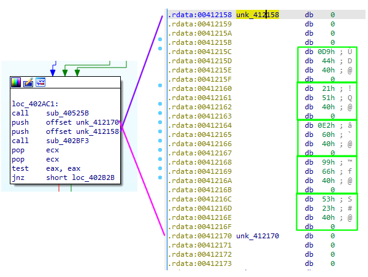

+++
title = "ESET CrackMe 2017"
date = "2021-05-21T14:43:00-06:00"
author = ""
authorTwitter = "" #do not include @
cover = ""
tags = ["Windows", "PE", "crackme"]
keywords = []
description = "Solving ESET's 2017 CrackMe"
showFullContent = false
readingTime = false
+++

# ESET CrackMe 2017 Walkthrough
The antivirus company, [ESET](https://www.eset.com/), [publishes](https://join.eset.com/en/challenges/crack-me) “crackme”s as part of their application process for hiring reverse engineers. The [crackme.zip](../../files/rebuilding-pe-files/crackme.zip) in this discussion came from May 2021 and has a MD5 hash of `429db63eb6937538f54dd94808a454df`. Based on the date of the signatures on the file, this was initially published in 2017. This article is the documentation of my attempt at solving the challenge. It may contain rabbit holes, inaccurate initial assumptions, or other problems. Some of this may be cleaned up at a later date.

If your intent is to apply to ESET, please don't use this post to solve it. That would be a disservice to yourself and ESET.

If opening the file in 7zip, you will see the following:
| Name        | Size | Virtual Size | Offset | Virtual Address |
|--           |--    |--            |--      |--               |
| .data       | 4608 | 11960        | 90112  | 0x18000         |
| .rdata      | 22528| 22348        | 67584  | 0x12000         |
| .text       | 66560| 66463        | 1024   | 0x1000          |
| CERTIFICATE | 16512| 16512        | 94720  |                 |

The fact that it shows the virtual information and offsets should cause one to pause and realize that this is not a .zip file, but an .exe renamed to .zip. Opening this file with another zip utility, such as the Windows default, would have produced an error which would have triggered deeper inspection and caused one to see the MZ file header as well.

Admittedly, I did not notice the additional columns until I was writing up this document. Since 7zip showed the files, I just suspected that ESET had taken a different approach for this CrackMe and I proceeded to attempt to rebuild the PE manually. You can find that write-up [here](https://noxwizard.github.io/posts/rebuilding-pe-files/).

This article will be light on screenshots since they take up a lot of space. Several of the functions also have large graphs that won’t easily fit on the screen. The expectation is for the reader to follow along with their own copy.

## Analysis
The first step is to rename the file to crackme.exe and load it into your reverse engineering tool of choice. For this write-up, I am using IDA Free 7.6. The entrypoint should be identified as `0x401CBD`. From there, I just started documenting and renaming functions. My approach for this is mainly following `call`s until I reach a Windows API function so I can try to figure out what the function is doing.

There are a lot of global variables (`dword_xxxxxx`), so I tried to identify ones that were obvious and ones that had several cross references pointing to them. If there weren’t many references to it and it wasn’t really clear, I just moved on.

The first couple of blocks check to see if the binary has a valid DOS, PE, and PE32 header and then checks to see if there is a .NET data directory or not. This mainly seems to be so that it knows whether to call `CorExit` or `TerminateProcess`.

The next block (`0x401B55`), sets up a global variable (`dword_4196E0`) to hold a pointer to the main process heap. It comes from a call to [GetProcessHeap](https://docs.microsoft.com/en-us/windows/win32/api/heapapi/nf-heapapi-getprocessheap).

The next block (`0x401B69`) does a lot of initialization related tasks. `sub_402B9F` starts by encoding a NULL pointer and then copying it to several global variables. I never figured out what they were used for, but it didn’t really seem to matter. The rest of the function gets a handle to kernel32.dll via [GetModuleHandleW](https://docs.microsoft.com/en-us/windows/win32/api/libloaderapi/nf-libloaderapi-getmodulehandlew) and then uses [GetProcAddress](https://docs.microsoft.com/en-us/windows/win32/api/libloaderapi/nf-libloaderapi-getprocaddress) to obtain function pointers to 29 functions and stores their pointers in global variables. These functions are related to Fiber Local Storage, Thread Local Storage, Critical Sections, Semaphores, and a few other functions. It is helpful to rename all of these variables to denote that they are function pointers so that it’s easier to see them during the rest of the analysis. The rest of `sub_4027C7` initializes a critical section and sets up local storage.

It wasn’t immediately obvious what was going on in the next block (`0x401B7A`) other than the file’s type was being checked and more critical sections were being initialized.

The next block (`0x401B94`) starts with a call to [GetCommandLineA](https://docs.microsoft.com/en-us/windows/win32/api/processenv/nf-processenv-getcommandlinea) and stores its result into the global variable `dword_41AEB4`. The block then calls a function (`sub_403707`) which fetches the process’ environment variables (via [GetEnvironmentStringsW](https://docs.microsoft.com/en-us/windows/win32/api/processenv/nf-processenv-getenvironmentstringsw)) and then converts it from wide characters to multibyte characters. That string is then stored in `dword_41906C`. The last function call in this block is to `sub_4032D2`. It first makes a call to [GetModuleFileNameA](https://docs.microsoft.com/en-us/windows/win32/api/libloaderapi/nf-libloaderapi-getmodulefilenamea) which in this case will retrieve the absolute path of the binary itself. The function then makes calls to `sub_403383` which looks like it’s dealing with escapes since it is referencing double quotes, spaces, and slashes. The net effect of this block is that `dword_4190A4` contains the path to the binary.

It is not immediately clear what is going on in the next block (`0x401BBA`) other than that it is iterating over the environment variables.

The next block (`0x401BCB`) is where it starts getting interesting.


`sub_40525B` isn’t too interesting, it encodes a pointer to a function which shows an error message and quits. If we look at the next two offsets which are passed into `sub_402BF3`, we can observe that they look like addresses. If we convert those into dwords, they become valid references to other functions in the program. The next function, `sub_402BF3`, will iterate through the array of functions and call each one. This particular set of functions isn’t too interesting. The first potentially does some stuff related to Code Pages, the second allocates some heap space, encodes its pointer, and stores it in a global variable. The third function isn’t too clear, but it does copy some addresses to another location. The fourth function uses the cpuid instruction to try and determine if it’s running in a VM and sets a global variable. The last function sets up an unhandled exception filter. While these functions aren’t interesting, we see this pattern again a little farther into the same function.

The second array of functions are from 0x412144 to 0x412154. There are three functions in this array. The first and second get handles to `STDIN` and `STDOUT` using [GetStdHandle](https://docs.microsoft.com/en-us/windows/console/getstdhandle). These are stored for later use to read and write to the console. The third function (`sub_411390`) is where things get interesting, because it calls `sub_401000`.

The first thing we see in `sub_401000`, is a call to `sub_4012F0` which simply sets `EAX` to `fs:30h`. In Windows, the File Segment register (`FS`) for 32-bit applications points to the process’ [Thread Environment Block](https://en.wikipedia.org/wiki/Win32_Thread_Information_Block) ([MSDN](https://docs.microsoft.com/en-us/windows/win32/api/winternl/ns-winternl-teb)). At offset 0x30 is the [Process Environment Block (PEB)](https://en.wikipedia.org/wiki/Process_Environment_Block) ([MSDN](https://docs.microsoft.com/en-us/windows/win32/api/winternl/ns-winternl-peb)). The PEB was intended to be an internal data structure only used by the Windows internals. However, its details have slowly been documented over the years. There is also a surprising amount of information about these structures available by using WinDBG.

The current assembly block we’re looking at contains the following:
```
call    get_peb
mov     [ebp+peb], eax
mov     eax, [ebp+peb]
mov     ecx, [eax+0Ch]
mov     edx, [ecx+1Ch]
mov     [ebp+var_10], edx
```

From the MSDN documentation, we know that at `PEB:0Ch`, is the `Ldr` member, which has a type of [PEB_LDR_DATA](https://docs.microsoft.com/en-us/windows/win32/api/winternl/ns-winternl-peb_ldr_data). The MSDN documentation is pretty light for this structure, so let’s look at what WinDBG shows. Running the command `dt _PEB_LDR_DATA` in WinDBG yields the following output:
```
0:000> dt _PEB_LDR_DATA
ntdll!_PEB_LDR_DATA
   +0x000 Length           : Uint4B
   +0x004 Initialized      : UChar
   +0x008 SsHandle         : Ptr32 Void
   +0x00c InLoadOrderModuleList : _LIST_ENTRY
   +0x014 InMemoryOrderModuleList : _LIST_ENTRY
   +0x01c InInitializationOrderModuleList : _LIST_ENTRY
   +0x024 EntryInProgress  : Ptr32 Void
   +0x028 ShutdownInProgress : UChar
   +0x02c ShutdownThreadId : Ptr32 Void
```

At offset 0x1C, we see the `InInitializationOrderModuleList` member, which has a type of [_LIST_ENTRY](https://docs.microsoft.com/en-us/windows/win32/api/winternl/ns-winternl-peb_ldr_data#remarks). These entries are doubly linked lists which contain a forward entry (`FLink`) and backwards entry (`BLink`). MSDN tells us that the type of each list entry is `LDR_DATA_TABLE_ENTRY`, which contains information about the loaded DLLs for the process.

So the assembly code now looks like this:
```
call    get_peb
mov     [ebp+peb], eax
mov     eax, [ebp+peb]
mov     ecx, [eax+PEB.Ldr]
mov     edx, [ecx+PEB_LDR_DATA.InInitializationOrderModuleList.Flink]
mov     [ebp+peb_module_list], edx
```

When trying to traverse the linked lists and line them up with their corresponding data structures, you need to recall that the linked lists are part of the `LDR_DATA_TABLE_ENTRY` itself and they aren’t pointers to a linked list. A `LIST_ENTRY` works by having the data attached below itself. To access the data within the entry, you typically use the [CONTAINING_RECORD](https://docs.microsoft.com/en-us/windows-hardware/drivers/kernel/mm-bad-pointer#containing_record) macro, pass it the desired type, member field, and its pointer, and it will return a pointer to the data for you.


Rather than using the `CONTAINING_RECORD` macro, you can also manually compute the address by adding the size of `LIST_ENTRY` to its pointer.

In the case of the `LDR_DATA_TABLE_ENTRY`, it looks like this:


Since IDA only sees the results of this macro being applied, you need to account for that in your structure definitions. In order for it to be mapped properly, you will need to define a custom `LDR_DATA_TABLE_ENTRY` without the `InLoadOrderLinks` and `InMemoryOrderLinks` fields. This is because our pointer is to the `InInitializationOrderLinks` list, so IDA will try to align the structure there instead at the top of the structure (`InLoadOrderLinks`).

The next set of assembly in this function looks like this:
```
loc_40101D:
mov     eax, [ebp+peb_module_list]
movzx   ecx, word ptr [eax+1Ch]
add     ecx, 2
mov     [ebp+var_6C], ecx
mov     edx, [ebp+var_10]
mov     eax, [edx+20h]
mov     [ebp+var_64], eax
mov     [ebp+var_20], 0
jmp     short loc_401045
```

If you attempted to apply a normal LDR_DATA_TABLE_ENTRY definition to this, you would have ended up with this:
```
loc_40101D:
mov     eax, [ebp+peb_module_list]
movzx   ecx, word ptr [eax+LDR_MODULE.EntryPoint]
add     ecx, 2
mov     [ebp+var_6C], ecx
mov     edx, [ebp+peb_module_list]
mov     eax, [edx+LDR_MODULE.SizeOfImage]
mov     [ebp+var_64], eax
mov     [ebp+var_20], 0
jmp     short loc_401045
```

When you really wanted this:
```
loc_40101D:
mov     eax, [ebp+peb_module_list]
movzx   ecx, word ptr [eax+ININITORDER_LDR_MODULE.BaseDllName.Length]
add     ecx, 2
mov     [ebp+var_6C], ecx
mov     edx, [ebp+peb_module_list]
mov     eax, [edx+ININITORDER_LDR_MODULE.BaseDllName.Buffer]
mov     [ebp+var_64], eax
mov     [ebp+var_20], 0
jmp     short loc_401045
```

I didn’t notice this at first and it made the rest of the code very peculiar since I knew it was operating on the DLL name, but thought it was a very strange way to acquire it.

The next thing that happens is the function iterates through the module list. For each module, it does the following:
1. Convert the name to all lowercase
1. Compute a hash of the function name
1. Check that hash against 0x19B9AC28
1. If the hash does not match, advance the module list to the next entry, if not already back to the beginning of the list

If you run the program in a debugger and set a breakpoint here, you will find that it is looking for kernel32.dll.

The next part of this function uses the base address of kernel32.dll which is loaded into the process memory and parses its PE header. It extracts the RVA to the export directory, the address of the function names and ordinals. Similar to with the module names, the list of exported functions is iterated and the following happens:
1. The function name is hashed
1. The hash is compared against 0xD9A63D0D
1. If the hash doesn’t match, a counter is incremented to advance to the next function

If you run the program in a debugger and set a breakpoint here, you will find that it is looking for `GetModuleFileNameW`.

The counter is then used to find the function’s ordinal using the ordinals list address it saved from earlier. That is then used to find the function’s RVA, which is then added to kernel32’s base address to get a valid function pointer.

The [GetModuleFilenameW](https://docs.microsoft.com/en-us/windows/win32/api/libloaderapi/nf-libloaderapi-getmodulefilenamew) function is then called with a NULL handle to get the full path to the binary. The `sub_4018AB` function then trims that full path down to only the name of the binary, without the file extension. `sub_401790` then compares the binary name to “`Cr4ckM3`”. It doesn’t do this with a traditional string comparison, it is done two bytes at a time and performed as an integer comparison. If you were looking through the binary’s strings, this would not have shown up.

That wraps up block (`0x401BCB`). The next one is `0x401BDE`. If your binary does not have the correct name (Cr4ckM3.exe), then it will exit before reaching this block. The first thing `sub_4013F0` does is to check and see if a debugger is attached. If you are using IDA, you can set a conditional breakpoint on the `test eax, eax` line and set the condition to “`EAX = 0`”. This will automatically make the condition succeed so that the program doesn’t exit.

`sub_4013A0` is the next function call we see. This is an xor “encryption” function. It takes 4 arguments: the buffer to en/decrypt, the length of the buffer, the encryption key, and an increment amount. The increment amount is added to each subsequent byte that is en/decrypted. In the first call, we see that buffer `0x418000` is being decrypted with the key of 0x25 and an increment amount of 3. The first byte is xor’d with the value of 25, the second byte is xor’d with the value of 28, and so on. The string “Please enter a valid password : “ is printed to the screen and then the buffer is re-encrypted so that it is not as easily spotted in memory.

The console then waits for input from the user. We can see that [ReadConsoleA](https://docs.microsoft.com/en-us/windows/console/readconsole) has been called with a max length of 10. The next bit of code is checking the supplied password to see if it is correct. A simple string comparison is not being done, so it is not possible to directly obtain the password from the disassembly. We can, however, see what comparisons are being done and try to deduce the password from them.

The first comparison is:
```
mov     edx, 1
imul    edx, 7
movsx   eax, [ebp+edx+Buffer]
mov     ecx, 1
imul    ecx, 6
movsx   edx, [ebp+ecx+Buffer]
add     eax, edx
cmp     eax, 0CDh ; 'Í'
```

Here, letters 7 and 6 are being added together and being compared to 0xCD. For brevity, I won’t show the other five blocks, but their logic is deduced the same way. The final set of comparisons is:

| 0 | 1 | 2 | 3 | 4 | 5 | 6 | 7 | 8 | 9 | Need |
|-- |-- |-- |-- |-- |-- |-- |-- |-- |-- |--    |
|   |   |   |   |   |   | x | x |   |   | 0xCD |
|   |   |   |   |   | x |   |   | x |   | 0xC9 |
|   |   |   | x |   |   | x | x |   |   | 0x13A|
|   |   |   |   | x | x |   |   | x | x | 0x16F|
| x | x |   |   |   |   |   |   |   |   | 0xC2 |
| x | x | x | x | x | x | x | x | x | x | 0x39B|

This results in a system of equations. While we could try to solve it by hand, that’s tedious and we have technology that can do that for us. For this task, we can employ a satisfiability solver, or a SAT solver. A SAT solver will attempt to find a solution that satisfies the constraints which have been provided. In our case, the constraints are the summations across each row.

There are several SAT solvers available, but for this write-up, I will use the [Z3 theorem prover](https://github.com/Z3Prover/z3) created by Microsoft since it has Python bindings. Below is the script I used:
```python
from z3 import *
solver = Solver()
L0, L1, L2, L3, L4, L5, L6, L7, L8, L9 = BitVecs('L0 L1 L2 L3 L4 L5 L6 L7 L8 L9', 32)
solver.add(UGE(L0, 32))
solver.add(ULE(L0, 126))
solver.add(UGE(L1, 32))
solver.add(ULE(L1, 126))
solver.add(UGE(L2, 32))
solver.add(ULE(L2, 126))
solver.add(UGE(L3, 32))
solver.add(ULE(L3, 126))
solver.add(UGE(L4, 32))
solver.add(ULE(L4, 126))
solver.add(UGE(L5, 32))
solver.add(ULE(L5, 126))
solver.add(UGE(L6, 32))
solver.add(ULE(L6, 126))
solver.add(UGE(L7, 32))
solver.add(ULE(L7, 126))
solver.add(UGE(L8, 32))
solver.add(ULE(L8, 126))
solver.add(UGE(L9, 32))
solver.add(ULE(L9, 126))
solver.add(
  L6+L7 == 205,
  L5+L8 == 201,
  L3+L6+L7 == 314,
  L4+L5+L8+L9 == 367,
  L0+L1 == 194,
  L0+L1+L2+L3+L4+L5+L6+L7+L8+L9 == 923
)
print(solver.check())
print(solver.model())
```

It sets up bit vectors for each letter of the password and then sets up the various constraints for them. The first 20 constraints are making sure that the values it gives us are within the printable range, since we’ll need to enter this via the keyboard. Normally, z3 allows you to do something like `solver.add(L0 < 32)`, but the first time I ran this, it gave me a password of “`D~0m~~~OK(`“ which didn’t look correct since that is a lot of repeated values. Z3 was making use of integer overflow to reach some of its answers. So, the initial constraints were changed to use “unsigned greater than or equals” and “unsigned less than or equals” to bound the solutions.

The new solution provided was: ``^d0m^iUx`H``

When this is entered into the program, all checks pass and we reach the following check:
```
mov     eax, large fs:30h
movzx   eax, byte ptr [eax+2]
test    eax, eax
jnz     short loc_401632
```

Recall that `fs:30h` holds the PEB. At offset 0x2 into the PEB is the `BeingDebugged` field which indicates if a debugger is attached. Earlier there was a call to `IsDebuggerPresent()`, which reads the same value. We can defeat this check the same way. Set a conditional breakpoint with a condition of “`EAX = 0`”.

In the next block, we see a call to [GetTickCount()](https://docs.microsoft.com/en-us/windows/win32/api/sysinfoapi/nf-sysinfoapi-gettickcount). There was one earlier immediately after the call to `ReadConsoleA`, which I didn’t mention. The two values are being subtracted to determine how much time has elapsed since the password was entered. This is another way to see if someone is using a debugger to manually step through or modify values. If more than 100 milliseconds have elapsed, the program exits. Set a conditional breakpoint on the jbe line with a condition of “`ZF = 1`” to force a jump to the right to continue execution.

Next, we see a call to `sub_401300`, which is computing a hash of the provided password. That hash is then compared to `0x1928F914`. In our case, we fail this check and end up taking the right hand side branch which decrypts another string from memory (`0x418038`) and then prints it to the screen:
```
Good work. Little help:
char[8] = 85
char[0] + char[2] = 128
char[4] - char[7] = -50
char[6] + char[9] = 219
```

While we had one correct solution, it was not the only or expected solution. To help us find the right solution, they have provided additional constraints. Now, we just add those constraints into our solver and run it again:
```python
solver.add(L8 == 85)
solver.add(L0 + L2 == 128)
solver.add(L4 - L7 == -50)
solver.add(L6 + L9 == 219)
```
This time, we receive the following password: `Pr0m3theUs`
It actually spells something in leetspeak, so it looks promising.

The password passes all the checks from before and is then used as part of another xor decryption function to decrypt the string at `0x4180A8`. It is then printed to the screen:
> https://join.eset.com/ae50b61499d27d7da010c718f265a9a1/crackme.zip

This is a link to their 2015 crackme. While this crackme has several posted solutions, it does contain a text file with an email address for you to submit your solution.

For completeness, the other branch with an encrypted string (`0x418020`) prints out “Wrong password!”

I enabled instruction tracing in IDA and ran it with the correct solution and it looks like quite a bit of the program was covered. A lot of the untraced functions looked like error handling, clean up, or were related to locale. Not all of them were, so there might be an easter egg hidden somewhere that I didn’t find.

That is the end of this write-up. Hopefully it was interesting.