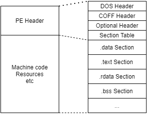
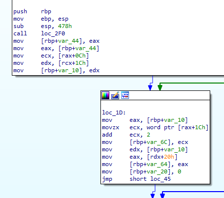
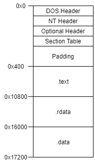
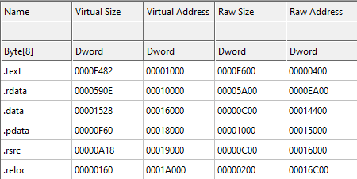
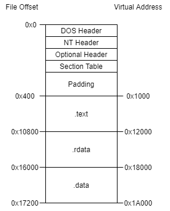
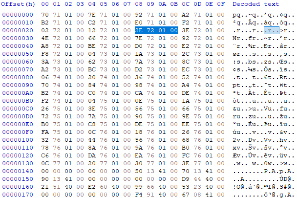
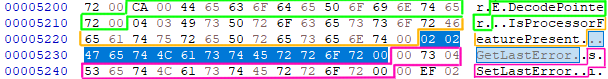
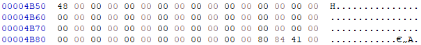

+++
title = "Rebuilding PE Files"
date = "2021-05-25T10:59:03-06:00"
author = ""
authorTwitter = "" #do not include @
cover = ""
tags = ["Windows", "PE"]
keywords = []
description = "Manually rebuilding a PE file from data sections"
showFullContent = false
readingTime = false
+++

# Rebuilding PE files from sections
Have you ever been in the unfortunate situation of having data sections from a PE file, but not the PE header itself and needed to recover it? Me neither. While attempting the [ESET crackme challenge](https://join.eset.com/en/challenges/crack-me), I mistakenly extracted the PE sections because 7z can do that apparently. Having only the text, data, and rdata sections, I set out to build a PE header that would load them correctly. This article may have errors along the way as it's a process of discovery. Any errors should be corrected at the very end where I discuss what I got right and wrong.

For those playing along at home, the crackme.zip in this discussion came from May 2021 and has a MD5 hash of `429db63eb6937538f54dd94808a454df`. The file can be found on ESET’s site (until it's changed) or [here](../../files/rebuilding-pe-files/crackme.zip).

When we extract the .zip file with 7zip, we get the following files:
| Name        | Size  |
|---          |---             |
| .data       | 4608 (0x1200)  |
| .rdata      | 22528 (0x5800) |
| .text       | 66560 (0x10400)|
| CERTIFICATE | 16512 (0x4080) |

With the exception of the certificate, they all have a nice hexadecimal size that lands on a 0x100 boundary. This will be more important later on, but is just an observation at this point.

This article will delve deep into several topics. Please bear with me as these are important and will be needed in order to build our binary from scratch.

### Tools
Some of the tools I used on this project:
* [IDA Free 7.6](https://hex-rays.com/ida-free/)
* [CFF Explorer](https://ntcore.com/?page_id=388)
* [HxD Hex Editor](https://mh-nexus.de/en/hxd/)


## What is a PE?
A Portable Executable, a .exe file on Windows. A PE file is broken down into multiple parts:


At the most basic level, there is the PE header which describes the executable and then there’s everything else which actually does things related to the program itself. Microsoft has pretty decent documentation about the PE format on [MSDN](https://docs.microsoft.com/en-us/windows/win32/debug/pe-format). Wikipedia’s documentation isn’t as good, but they have an excellent [diagram](https://en.wikipedia.org/wiki/File:Portable_Executable_32_bit_Structure_in_SVG_fixed.svg) that works nicely with the MSDN documentation.

The PE header itself is made up of four parts: the DOS header (and stub), the COFF header, the Optional header, and the section table.

### DOS Header
The DOS header is a holdover from the days of DOS and NT. Wikipedia says that the PE format was used to migrate between the two and Windows used it as well. Since the header was used on binaries across multiple operating systems, the DOS stub now only serves the purpose of printing an error message if you try to run a Windows binary on a DOS system. Microsoft seems to have removed the IMAGE_DOS_HEADER documentation, but it can be found [elsewhere](https://www.nirsoft.net/kernel_struct/vista/IMAGE_DOS_HEADER.html). As you can see, there are 19 fields in this header. Since it is obsolete though, only two really matter:
* `e_magic`: This field must be set to 0x5A4D (“MZ”)
* `e_lfanew`: This field contains the file offset to the COFF header

The other fields can be set to anything. The Windows PE loader will ignore them and only check those two fields. The reason that e_lfanew is an offset is so that a DOS stub can go immediately after the DOS header. The DOS stub is just a block of machine code to print an error on DOS machines. If it is known that a binary will only be run on Windows, the DOS stub is not required. For the purposes of this write-up, there will not be a DOS stub, so the offset will be `sizeof(IMAGE_DOS_HEADER)`, which is 64 bytes.

### COFF Header
The Common Object File Format header, also known as the NT header by Microsoft since they extended the original specification, is the start of the actual PE header. It describes the machine type it was built for, the number of sections in the file, and some characteristics. Documentation can be found [here](https://docs.microsoft.com/en-us/windows/win32/api/winnt/ns-winnt-image_nt_headers32). The magic bytes for this section are 0x4550 (“PE”).

### Optional Header
It’s called optional, but it really isn’t. It’s optional for object files, but required for the rest. The Optional header is actually a field in the COFF header, so it’s really a sub-header. The Optional header contains a lot of information about sizes, offsets, and alignments. Documentation for this header can be found [here](https://docs.microsoft.com/en-us/windows/win32/api/winnt/ns-winnt-image_optional_header32). At the end of this structure is an array which describes various “data directories”, such as the import table, export table, resource table, etc. These directories are located in the various sections of the file, so the directories contain the addresses of those tables.

### Section Table
Similar to the data directores, the section table describes the sections which compose the PE file. A section is just a distinct grouping of data. Common sections are:
* `.bss`: Uninitialized data (usually all zero)
* `.data`: Initialized data
* `.debug`: Contains debugging information
* `.edata`: Contains export information. Commonly seen on DLLs which export functions.
* `.idata`: Import information for when a program imports functions from other DLLs.
* `.rdata`: Read-only initialized data
* `.rsrc`: Resource data, such as embedded images and icons
* `.text`: Executable code

There are many other sections and it is not required to have those specific ones as long as the addresses in the data directories are set correctly. If you wanted, you could put your exports in `.idata` and your imports in `.edata` just to mess with people doing forensics on it.


## Taking Inventory
Now that we have a basic understanding of what comprises a PE file, let’s take inventory of what we have. We have a file called `.data`, so this will contain data for things like global variables that are initialized to some value. We have a `.rdata` file which is supposed to contain read-only things. This should contain things like string constants that would be read but not modified (think error messages). Then there’s the `.text` section which should be all of the executable code for the program. Finally, there’s a certificate file. It doesn’t appear to be DER or P7B formatted and it isn’t PEM formatted, so as a whole, it isn’t a certificate. The `binwalk` utility does show several certificates in it and we can see the plaintext portions in a hex editor, so perhaps the file represents one of the certificate related directories.

Next, let’s put the `.text` file into IDA (other tools are available) and make sure it’s usable. IDA was able to successfully disassemble the file into what looks like sensible instructions. These also appear to all be 32-bit registers, so this is probably a 32-bit binary.




## Building the Headers
With those bits of information, let’s start putting them together. I am doing this in C++ with Visual Studio 2019 since the `Windows.h` header has all of the structures we need already.

First is the DOS header:
```cpp
IMAGE_DOS_HEADER dos;
memset(&dos, 0, sizeof(IMAGE_DOS_HEADER));
dos.e_magic = 0x5A4D;	// "MZ"
dos.e_lfanew = sizeof(IMAGE_DOS_HEADER);
```

As mentioned earlier, the modern PE loader in Windows only looks at these two fields, so we zero out the rest. Since we won’t be including the optional DOS stub, we can place the COFF header immediately after this one. That means the `lfanew` offset will just be the size of the header itself.

Next is the COFF header. Microsoft’s version of this is the `IMAGE_NT_HEADERS` structure. There is a 32-bit and 64-bit version of this structure, so we will use the 32-bit one.
```cpp
IMAGE_NT_HEADERS32 nt_header;
nt_header.Signature = 0x4550;	// "PE"
nt_header.FileHeader.Machine = IMAGE_FILE_MACHINE_I386;
nt_header.FileHeader.NumberOfSections = 3;	// text, data, rdata
nt_header.FileHeader.TimeDateStamp = 0x1234;
nt_header.FileHeader.PointerToSymbolTable = 0;
nt_header.FileHeader.NumberOfSymbols = 0;
nt_header.FileHeader.SizeOfOptionalHeader = sizeof(IMAGE_OPTIONAL_HEADER32);
nt_header.FileHeader.Characteristics = IMAGE_FILE_EXECUTABLE_IMAGE | IMAGE_FILE_32BIT_MACHINE;
```

This is pretty straightforward. We set the magic bytes of “PE” and set the machine type to be 32-bit x86. The number of sections is set to 3 since that’s all we were given. We can revise this later if we add our own. The timestamp doesn’t really matter, so we set it to an arbitrary value. We aren’t currently expecting there to be a symbol table, so the pointer to symbol table is 0 and the number of symbols in it is also set to 0. While it’s possible to use an Optional header with a different size, we will use the standard one, so it’s size is set to the size of the structure. For the characteristics flag, we set it so that the file is considered to be an executable (.exe) and that it’s for 32-bit systems.

Easy right? Well, now it gets harder. Next up is the Optional header, which is a member of the NT header.
```cpp
nt_header.OptionalHeader.Magic = IMAGE_NT_OPTIONAL_HDR32_MAGIC;
nt_header.OptionalHeader.MajorLinkerVersion = 0;
nt_header.OptionalHeader.MinorLinkerVersion = 0;
nt_header.OptionalHeader.SizeOfCode = 66560;	// Size of .text section
nt_header.OptionalHeader.SizeOfInitializedData = 93696;	// Size of .text + data sections
nt_header.OptionalHeader.SizeOfUninitializedData = 0;
```

The magic bytes and linker are simple enough. The linker values are set to 0 since we don’t care about them. `SizeOfCode` refers to the size of the `.text` section. The `SizeOfInitializedData` field is the summation of the sizes of the `.text`, `.data`, and `.rdata` sections since they all contain initialized data in them. Since we don’t have a `.bss` section, our `SizeOfUninitializedData` is 0.
```cpp
nt_header.OptionalHeader.AddressOfEntryPoint = ???
nt_header.OptionalHeader.BaseOfCode = ???
nt_header.OptionalHeader.BaseOfData = ???
nt_header.OptionalHeader.ImageBase = 0x00400000;
nt_header.OptionalHeader.SectionAlignment = 0x1000;
nt_header.OptionalHeader.FileAlignment = 0x200;
```

The entrypoint is something we’ll have to figure out (or guess). The base of code and base of data are Relative Virtual Addresses based on information from the sections and the order they’re in. We’ll come back to those after we have filled out their section headers. The image base is set to 0x00400000, which is Microsoft’s default for normal applications. The file alignment is set to 512 (0x200) which is the default on Windows. This value dictates how sections on disk should be aligned, so each section should fall on a 512 byte boundary when we build the final binary image. The section alignment dictates how sections should be aligned in memory. The only requirement is that it is at least as large as the file alignment. This is set to 0x1000 to make the addresses simpler later on.

```cpp
nt_header.OptionalHeader.MajorOperatingSystemVersion = 6;
nt_header.OptionalHeader.MinorOperatingSystemVersion = 0;
nt_header.OptionalHeader.MajorImageVersion = 0;
nt_header.OptionalHeader.MinorImageVersion = 0;
nt_header.OptionalHeader.MajorSubsystemVersion = 6;
nt_header.OptionalHeader.MinorSubsystemVersion = 0;
nt_header.OptionalHeader.Win32VersionValue = 0;
```

A few more easy fields. This sets the minimum operating system to Windows Vista (6) and the subsystem version to the same as the OS version. The image version is for our own version number if we have one and the Win32 version value is reserved and must be set to 0.

```cpp
nt_header.OptionalHeader.SizeOfImage = 0x27000;
nt_header.OptionalHeader.SizeOfHeaders = 0x400;
nt_header.OptionalHeader.CheckSum = 0;
nt_header.OptionalHeader.Subsystem = IMAGE_SUBSYSTEM_WINDOWS_CUI;
nt_header.OptionalHeader.DllCharacteristics = IMAGE_DLLCHARACTERISTICS_NO_SEH;
nt_header.OptionalHeader.SizeOfStackReserve = 0x100000;
nt_header.OptionalHeader.SizeOfStackCommit = 0x1000;
nt_header.OptionalHeader.SizeOfHeapReserve = 0x100000;
nt_header.OptionalHeader.SizeOfHeapCommit = 0x1000;
nt_header.OptionalHeader.LoaderFlags = 0;
nt_header.OptionalHeader.NumberOfRvaAndSizes = IMAGE_NUMBEROF_DIRECTORY_ENTRIES;

memset(nt_header.OptionalHeader.DataDirectory, 0, sizeof(IMAGE_DATA_DIRECTORY) * IMAGE_NUMBEROF_DIRECTORY_ENTRIES);
```

The image size doesn’t seem to need to be too accurate. It should be at least as large as the file itself and aligned using the value in the `SectionAlignment` field. `SizeOfHeaders` is the summation of the DOS, NT, Optional headers, and Section headers rounded up based on the `FileAlignment` field. That comes out to be 0x400. The checksum can be left as zero and the system will ignore it. The subsystem is set as a console application. There are a variety of different DLL characteristics that can be set, but I have disabled most of them to make things easier. The only one I set for now is that it doesn’t use SEH. Based on further investigation of the executable code, we may have to change that. The stack and heap values are just some defaults that Microsoft uses. They aren’t documented anywhere, but that’s what Visual Studio defaults to. Loader flags is an obsolete field and left as 0. The RVA count is set to the default constant of 16.

The only thing left is populating the `nt_header.OptionalHeader.DataDirectory` array. Most of them will probably be zero and we will probably need the import tables, but we’ll come back to this later after some more investigation.


## Creating Sections
Next up is the section table. One of the fields in the section entry is about the raw offset into the file. So let’s figure out what our file layout is probably going to look like. Looking at some other executables with CFF Explorer, the section ordering commonly seems to be: .text, .rdata, .data. Based on that, our layout should look like this:



The padding is necessary since we previously set our file alignment to 0x200. Conveniently, the other sections have sizes that fall on to the alignment. This means we have our raw offsets figured out. When a section gets loaded into memory, it gets loaded at a specific address in virtual memory. We get to choose that address, which means we need to figure out if those sections are expected to be at any specific address based on internal references (function addresses, global variable addresses, etc.).

Let’s first look at some other binaries in CFF Explorer and see if there are any common starting addresses. I picked a couple of binaries at random and looked at the “Section Headers” section in CFF Explorer. The first section, which was usually `.text`, always had a Virtual Address which started at 0x1000. That seems like a reasonable place to put ours. While we’re looking at the sections, let’s see if there’s anything else we can take away from it.



This file also has a 0x1000 section alignment like ours does. Their `.text` section starts at 0x1000 and has a raw size of 0xE600. Something to note here is that it has a virtual size of 0xE482 and not 0xE600. This would indicate that this section was padded to reach its 0x200 file alignment boundary. Ours already all align, so our virtual sizes should all be the same as the raw size, which is nice.

Their next section is `.rdata`, which starts at 0x10000. Since the `.text` section covers 0x1000-0xF482, 0x10000 is the next 0x1000 aligned boundary. So that makes sense. This section covers the address space of 0x10000-0x1590E, so the next section should probably start at 0x16000.

Sure enough, the .data section starts at 0x16000. From the looks of these sections so far, they’re just back-to-back. From my own initial experimentation, if the section addresses are not contiguous, Windows will fail to load the binary with the error “Not a valid Win32 application”.

For our sections, the addresses should be something like this:
| Section | Size    | Start Address | End Address | End (Aligned) |
|--       |--       |--             |--           |--             |
| .text   | 0x10400 | 0x1000        | 0x11400     | 0x12000       |
| .rdata  | 0x5800  | 0x12000       | 0x17800     | 0x18000       |
| .data   | 0x1200  | 0x18000       | 0x19200     | 0x1A000       |


So our file layout now looks like this:



Seems reasonable. Now we need to make the section table entries for them. The Windows structure for this is [IMAGE_SECTION_HEADER](https://docs.microsoft.com/en-us/windows/win32/api/winnt/ns-winnt-image_section_header).

First the `.text` section:
```cpp
IMAGE_SECTION_HEADER text_section;
memset(&text_section, 0, sizeof(IMAGE_SECTION_HEADER));
const char* text_name = ".text";
memcpy(text_section.Name, text_name, 5);
text_section.VirtualAddress = 0x1000;
text_section.SizeOfRawData = 0x10400;
text_section.Misc.VirtualSize = text_section.SizeOfRawData;
text_section.PointerToRawData = 0x400;
text_section.Characteristics = IMAGE_SCN_CNT_CODE | IMAGE_SCN_MEM_EXECUTE | IMAGE_SCN_MEM_READ;
```
Nothing unexpected here, it all comes from the table above. For the characteristics, we need to mark this section as readable and executable (since it’s the program part) as well as a code section.

Next, the `.rdata` section:
```cpp
IMAGE_SECTION_HEADER rdata_section;
memset(&rdata_section, 0, sizeof(IMAGE_SECTION_HEADER));
const char* rdata_name = ".rdata";
memcpy(rdata_section.Name, rdata_name, 6);
rdata_section.VirtualAddress = 0x012000;
rdata_section.SizeOfRawData = 0x5800;
rdata_section.Misc.VirtualSize = rdata_section.SizeOfRawData;
rdata_section.PointerToRawData = 0x10800;
rdata_section.Characteristics = IMAGE_SCN_CNT_INITIALIZED_DATA | IMAGE_SCN_MEM_READ;
```
This section only needs to be readable and marked as a data section.

Finally, the `.data` section:
```cpp
IMAGE_SECTION_HEADER data_section;
memset(&data_section, 0, sizeof(IMAGE_SECTION_HEADER));
const char* data_name = ".data";
memcpy(data_section.Name, data_name, 5);
data_section.VirtualAddress = 0x18000;
data_section.SizeOfRawData = 0x1200;
data_section.Misc.VirtualSize = data_section.SizeOfRawData;
data_section.PointerToRawData = 0x16000;
data_section.Characteristics = IMAGE_SCN_CNT_INITIALIZED_DATA | IMAGE_SCN_MEM_READ | IMAGE_SCN_MEM_WRITE;
```
While the `.rdata` section is supposed to be read-only, this section is intended to be written to, so it will be marked as readable, writable, and as a data section.

Earlier, we skipped some fields in the Optional header since we didn’t know what they were yet. We can now mostly fill those out:
```cpp
nt_header.OptionalHeader.AddressOfEntryPoint = 0x1000;
nt_header.OptionalHeader.BaseOfCode = 0x1000;
nt_header.OptionalHeader.BaseOfData = 0x12000;
```

`BaseOfCode` is the virtual address of the code section (`.text`) and `BaseOfData` is the virtual address of the first data section (`.rdata`). The entrypoint is still unknown, but as a guess, we can set it as the start of the code section. This is rather unusual since most entrypoints are not at the very beginning of their code section, but it’s just a guess and is all we have for now.

It looks like we have most of the pieces figured out. What if we tried to run it? Surely it’s not that simple, but why not. And… nothing happens. No error though, so that’s something. Let’s run it with IDA’s debugger and see if it gives us an error message.

This time, we get: 
> 1722E: The instruction at 0x1722E referenced memory at 0x1722E. The memory could not be executed -> 0001722E (exc.code c0000005, tid 13548)

After enabling tracing in IDA, I found that the offending instruction is:
```
call    ds:dword_412028
```
At 0x412028 is the value 0x1722E.

Well, we didn’t really expect it to work. We left all those data directories empty and the binary is too small to not have any imports at all in it.


## The Import Tables
### Addresses
First we need to talk about some nomenclature regarding addresses. There are two kinds of addresses that we will see references to and their names get abused a bit.

#### Virtual Addresses
These are fully qualified addresses that include the base address of the program. For example, our program’s base is set to 0x400000 (`OptionalHeader.ImageBase`), so a virtual address would be something like 0x401234. That address would be 234 bytes into the `.text` section since it starts at 0x1000.

Unfortunately, the section header structure (`IMAGE_SECTION_HEADER`) has a field called `VirtualAddress` which uses a different meaning. That is really a relative address, which leads into the next type:

#### Relative Virtual Addresses (RVAs)
An RVA is a relative address from the base of the image. If we have an RVA of 0x1234 and our image base is 0x400000, the corresponding Virtual Address is 0x401234. Likewise, given a Virtual Address of 0x400123 and knowing the base address, we can determine the RVA.

This is important because as we look through these sections in the binary files, we will come across a mix of both kinds and need to know to recognize them as well as be able to translate them.

Fortunately, CFF Explorer has an Address Converter page which can translate between Virtual Addresses, RVAs, and file offsets.


### Find the Pattern
One thing humans are good at is recognizing patterns. This is very helpful when doing reverse engineering work, like what we’re about to do. Admittedly, the patterns are more difficult to recognize when they’re in the form of hex dumps.

When I did this the first time, I didn’t attempt to run the binary this early, so I didn’t really have a starting point other than seeing “kernel32.dll” referenced as text in one of the sections. This time though, we have a starting address to look at. IDA gave us an error saying that it tried to make a function call to the address stored at `0x412028`. First, we need to convert this to addresses and offsets we can look at. The RVA is `0x12028`, which places it 0x28 bytes into the `.rdata` section. That’s pretty close to the beginning, so let’s see what that chunk of the file looks like:



Remember that x86 uses little endian encoding, so you need to read the bytes in reverse. At 0x28, we see the `0x01722E` value that IDA was complaining about. If we look at the bytes around it, it looks like there’s a lot of other addresses like this one. So some kind of array of addresses.

Let’s see if we can figure out what that’s pointing to. If we consider `0x01722E` as an RVA, that would put it 0x522E bytes into the `.rdata` section. So let’s take a look at that:



The part in blue highlighting is the referenced data. We see 2 bytes, followed by what looks like a function name. This was related to a `call` instruction, so that’s good. If we again look at the surrounding bytes, we see the same pattern (mostly) of 2 bytes, followed by a function name.

It didn’t make it into the screenshot, but at 0x51D2-51DE is the string “KERNEL32.DLL”. If we look up one of those functions, like [GetLastError](https://docs.microsoft.com/en-us/windows/win32/api/errhandlingapi/nf-errhandlingapi-getlasterror), we see that it comes from kernel32.dll. So this is most likely related to imports. With that in mind, let’s take a look at what’s related to handling imports in a PE.

#### Imports in PE Files
There are several areas in the PE related to imports. The first is the .idata section which is a section exclusively used for storing import information. Compilers are not required to actually separate out the imports into their own section, so ours is probably a part of the .rdata section since that’s where we’ve come across it. While we don’t have a dedicated section, it is useful to know what it is supposed to look like. [MSDN](https://docs.microsoft.com/en-us/windows/win32/debug/pe-format#the-idata-section) says it has the following layout:
* Directory Table (Import directory)\
Null Directory Entry
* DLL1 Import Lookup Table\
Null
* DLL2 Import Lookup Table\
Null
* DLL3 Import Lookup Table\
Null
* Hint-Name Table

In the Optional header, at the very end, is a directory array. Two of the directories are related to imports:
* [Import directory](https://docs.microsoft.com/en-us/windows/win32/debug/pe-format#import-directory-table):
> The import directory table consists of an array of import directory entries, one entry for each DLL to which the image refers. The last directory entry is empty (filled with null values), which indicates the end of the directory table.
* [Import address table](https://docs.microsoft.com/en-us/windows/win32/debug/pe-format#import-address-table): 
> The structure and content of the import address table are identical to those of the import lookup table, until the file is bound.

Binding refers to when the executable gets loaded into memory. So what does MSDN have to say about the “[import lookup table](https://docs.microsoft.com/en-us/windows/win32/debug/pe-format#import-lookup-table)”?: 
> An import lookup table is an array of 32-bit numbers for PE32 … The collection of these entries describes all imports from a given DLL. The last entry is set to zero (NULL) to indicate the end of the table.

Depending whether the last bit is set or not, this value describes a RVA or an ordinal.

The Hint/Name table is mentioned in the import section layout, but is not part of the Optional header directory. [MSDN](https://docs.microsoft.com/en-us/windows/win32/debug/pe-format#hintname-table) says that there is generally only one of these and that it consists of a 2 byte hint followed by the ASCII name of a function to import. Additionally, the name may be padded with 0 or 1 NULL bytes to align the next entry on an even boundary.


### The Hunt Resumes
Now that we know a little bit more about imports, let’s see if we can match up some of the data we found with some of those tables. The table at the very beginning of the .rdata file looks like a list of RVAs. Interestingly, there is a duplicate of that table at 0x502C-516B. I’m not sure what the difference is yet, but we know the first one was actually referenced, so let’s assume it’s the important one for now. This could be our Import Address Table since it’s a list of just RVAs. They all look the same, so it doesn’t look like any are ordinal based lookups. So our working assumption will be that 0x12000 is the IAT directory entry.

How about those function names though? They seem to fit the description of the hint/name table: a 2 byte hint followed by a NULL-terminated function name with an optional byte of padding. The address of this table doesn’t seem to be used anywhere, so it must be used internally and the PE loader knows how to find it. So we’ll assume that 0x17170-1774B is the hint table. Having the “KERNEL32.DLL” in the middle of it does seem odd, but the table otherwise fits.

That leaves the import directory table for us to find. From [this article](https://docs.microsoft.com/en-us/archive/msdn-magazine/2002/march/inside-windows-an-in-depth-look-into-the-win32-portable-executable-file-format-part-2#the-imports-section), we see that the structure pointed to by the Import Directory RVA is an `IMAGE_IMPORT_DESCRIPTOR` structure. It’s not on MSDN, but from `winnt.h`, we can see it:
```cpp
typedef struct _IMAGE_IMPORT_DESCRIPTOR {
    union {
        DWORD   Characteristics;   // 0 for terminating null import descriptor
        DWORD   OriginalFirstThunk;// RVA to original unbound IAT (PIMAGE_THUNK_DATA)
    } DUMMYUNIONNAME;
    DWORD   TimeDateStamp;     // 0 if not bound,
                               // -1 if bound, and real date\time stamp
                               //     in IMAGE_DIRECTORY_ENTRY_BOUND_IMPORT (new BIND)
                               // O.W. date/time stamp of DLL bound to (Old BIND)

    DWORD   ForwarderChain;    // -1 if no forwarders
    DWORD   Name;
    DWORD   FirstThunk;        // RVA to IAT (if bound this IAT has actual addresses)
} IMAGE_IMPORT_DESCRIPTOR;
```

So it’s a 4 byte RVA, followed by a timestamp, a forwarder chain, a pointer to a name (probably an RVA), and an RVA to the IAT.

We know that kernel32.dll shows up as a string and we know the address of our IAT. Using these two addresses, we need to find a block of 20 bytes that has those two addresses in it. After looking at some import entries for other binaries, it looks like the `FirstThunk` field points to the IAT at the beginning of the `.idata` section. The one we have identified is at the start of our `.rdata` file, so our `.rdata` file probably starts with the contents of the `.idata` section. So this means we are looking for a block of 20 bytes that ends with an RVA to “kernel32.dll” (0x171D2) and an RVA to our Import Address Table (0x12000). In HxD, we can do this search by using Search → Find → Hex-Values and searching for “`D2 71 01 00 00 20 01 00`”. This gives us one hit in the `.rdata` file: 0x5010. Since those are the last two fields, we need to backtrack the address by 12 bytes. That gives us 0x5004 (VA: 0x17004) as the start of the Import Directory. If we look at the first field (`OriginalFirstThunk`), it has a value of 0x1702C which is that duplicate IAT we found earlier (0x502C). It’s all coming together.

Now we can update the two directory entries to have actual values. The import directory:
```cpp
nt_header.OptionalHeader.DataDirectory[IMAGE_DIRECTORY_ENTRY_IMPORT].VirtualAddress = 0x017004;
nt_header.OptionalHeader.DataDirectory[IMAGE_DIRECTORY_ENTRY_IMPORT].Size = 0x28;
```

Recall from earlier that the layout of `.idata` dictates that the directory entry is followed by a completely blank entry. Ours is only the one 20 byte entry, so add in a second and that’s now 40 bytes (0x28).

The Import Address Table:
```cpp
nt_header.OptionalHeader.DataDirectory[IMAGE_DIRECTORY_ENTRY_IAT].VirtualAddress = 0x012000;
nt_header.OptionalHeader.DataDirectory[IMAGE_DIRECTORY_ENTRY_IAT].Size = 0x144;
```

Similarly, the IAT ends with a single blank RVA, so its range is 0x12000-12144. Let’s build it and put it in CFF Explorer and see how it looks. Well, the import directory is populated and all the function names show up. Looks like a success, let’s run it!

Like before, it ran and exited, Let’s see what IDA has to say. We receive the following error message: 
> 403B02: The instruction at 0x403B02 referenced memory at 0x41AE28. The memory could not be read -> 0041AE28 (exc.code c0000005, tid 17116)

The instruction in question:
```
mov     eax, dword ptr ds:unk_41AE28
```

Recall that the end of our executable’s address space is 0x41A000. This is accessing beyond the end. Are we missing a section? Do we need to add the certificate data on? That doesn’t seem right. The code around it shows a reference to [TlsGetValue](https://docs.microsoft.com/en-us/windows/win32/api/processthreadsapi/nf-processthreadsapi-tlsgetvalue), perhaps we need a `.tls` section? We didn’t have any other sections though, so that’s probably not it.

One other option is extending the `.data` section. Recall that a section’s `Misc.VirtualSize` field does not have to match its raw size. If it’s smaller, that indicates a section was padded to meet the alignment requirements. What if it’s larger? In that case, it is treated as uninitialized data, like a pseudo `.bss` section.

I’ll skip all the searching I did, but I spent some time browsing through IDA and looking at RVAs in the hex editor to see what references I could find that exceeded the file boundary. I found the following references:
* `ds:41AE28h`
* `ds:41AEA4h` - Used to hold result of a `EncodePointer()` call
* `ds:41AEACh` - Used to indicate that `sub_404868` has run
* `ds:41AEB4h` - Holds process's command line string

For a few of them, I captured some notes. They look like global variables, which is expected of the data sections. There may be other references that I missed, but 0x41AEB4 is the highest I came across. The sections need to be 0x1000 aligned, so we should be ok as long as I didn’t miss one way off the end.

Let’s try extending the `.data` section so that it ends at 0x41B000 instead of 0x41A000. The section’s raw size is 0x1200, which gets aligned to 0x2000. Since we’re trying to add an additional 0x1000 on top of the aligned length, that would be 0x3000. 0x3000 - 0x1200 is 0x1E00.
```cpp
data_section.Misc.VirtualSize = data_section.SizeOfRawData+0x1E00;
```

While browsing around, I also noticed `__SEH_prolog4` and `__SEH_epilog4`, which means this executable does use SEH and we should probably unset that flag that said we don’t use it.

No errors, but nothing happens when we run it. Let’s try IDA. IDA gives us the following error: 
> BB40E64E: The instruction at 0xBB40E64E referenced memory at 0xBB40E64E. The memory could not be executed -> BB40E64E (exc.code c0000005, tid 18764)

This new error is because one of the globals (`dword_418480`) is being called as a function. However, this path is guarded by a check against (`dword_41AE28`), yes the address that previously caused an error and we tried to work around it.

So this time, the problematic address (0x41AE28) can be read, but it has no value since it’s uninitialized memory. If that address is expected to have data in it, where do we get it? We don’t have any other sections to use (I still don’t think it’s the certificate data). Since IDA already has it loaded and disassembled, let’s see if there are cross-references to this address that populate it with data.

There are only 2 cross-references total. One is the location we are at now and the other is in `sub_402B9F`:
```
mov     dword_41AE28, eax
```

So it does get set. Let’s widen the scope a bit on this function and see what it’s doing. It’s a long function, so here is an editorialized version of the assembly:
```
push    offset aFlssetvalue ; "FlsSetValue"
push    edi
...
call    esi ; GetProcAddress
...
mov     dword_41AE2C, eax
```

[GetProcAddress](https://docs.microsoft.com/en-us/windows/win32/api/libloaderapi/nf-libloaderapi-getprocaddress) is being used to get the address of the `FlsSetValue` function. What that function does isn’t important. What’s important is that 0x41AE28 gets initialized at some point, but we’re trying to use it before that happens.

Remember way back at the beginning when we arbitrarily picked an entrypoint? Well, we picked the wrong one! Another sign that it’s the wrong one is that IDA shows that there is a cross-reference to it. Normally, an entrypoint won’t have any references to it since it’s the starting point of the program.

One option would be to start tracing the cross-references back until they stop. If we do that for our current start (0x401000), we land in a part of the program that IDA couldn’t disassemble into a function. I don’t know of a way to get IDA to show functions which have no cross-references to them. There are about 300 functions found by IDA, so randomly going through them and backtracking isn’t a pleasant thought.

Another approach would be to look through the imports table for functions that we think might be called early on in the life of the program. Similarly, we could go through the strings and look for something that might be printed. Things related to the command line come to mind. For example, if the wrong number of arguments are passed.

I don’t see any strings that fit the bill. There was one, but it was related to .NET and didn’t have any references. The import table did show [GetCommandLineA](https://docs.microsoft.com/en-us/windows/win32/api/processenv/nf-processenv-getcommandlinea), which had 3 references. If we follow the first reference (0x401B94), we land in a red section, which means the code has no references and wasn’t converted into a function and has therefore been decoded as single instructions. This could describe an entrypoint since nothing else should reference it. Now to find the beginning of it. There’s a label right above the call, so let’s follow the labels and see if they stop near something that looks similar to a function prologue. Eventually, we get to `loc_401AFC` which is right at the top of the red, single instructions. If we follow that cross reference, we go to 0x401CC2 which has a call right before it, and nothing else. IDA has marked the sections around it as unrelated. The instructions above it look like a function epilogue. While this doesn’t look like a normal entrypoint, let’s try setting the address of the call as our entrypoint. That address is `0x401CBD`, but the header wants a relative address, so it will be `0x1CBD`.

```cpp
nt_header.OptionalHeader.AddressOfEntryPoint = 0x1CBD;
```

Now when we run it, it outputs the following message to the console:
> “Please enter valid password :”.

It works!

Ok, I cheated a bit. Since I already completed the original crackme challenge, I knew that certain actions were performed early on that didn’t have a terribly deep call stack, like the call to `GetCommandLineA`. Normally, this would take a lot of trial and error to track down. It might be possible to write some scripts for [Ghidra](https://ghidra-sre.org/), [Capstone](https://www.capstone-engine.org/), IDA Pro, or another tool to help find functions without cross-references to narrow down the search space. You would probably still end up trying a bunch of different addresses before hitting upon the right one.


## How Close Did We Get?
We’re done, but how close to the original were we? What about the certificate section? Did we actually get the entrypoint right? What about when we expanded the `.data` section, was that the right amount? Since we do actually have the original version of this PE, let’s take a look at it with CFF Explorer and compare it to ours.

First is the difference in the value of the `SizeOfInitializedData` field in the Optional header. Ours is set to 0x16E00 which is the sum of the sizes of the `.text`, `.data`, and `.rdata` sections, while theirs is set to 0x8800. The documentation for this field states: “The size of the initialized data section, in bytes, or the sum of all such sections if there are multiple initialized data sections”. I had treated the code as initialized data, which is probably incorrect. If we subtract the size of the `.data` and `.rdata` sections from the 0x8800, that leaves 0x1E00, which is the size by which we expanded our `.data` section. I had treated that as uninitialized data, but it looks like that should count as initialized data. It seems we were on the right track at least.

The address of the entrypoint is indeed 0x1CBD, so we got that right. Additionally, the `BaseOfCode` is 0x1000 and the `BaseOfData` is 0x12000, which are the same as ours. The image base, section alignment, and file alignment all match too, which isn’t too surprising since they’re the OS defaults.

The `SizeOfImage` field should have been 0x1B000 while I had set it to 0x27000. I wasn’t sure where this came from exactly, but after spending time adjusting the sections and virtual addresses, we can see that 0x1B000 is the end of our section addresses after we extended it. So this field is describing the size of the virtual address space used by the executable.

The `DLLCharacteristics` fields were different, but that’s mainly because I set them so that we wouldn’t have to worry about the image getting relocated and having different addresses each time we loaded it in IDA.

For the data directories, our values matched for the Import Directory and Import Address Table. The original binary had two additional directories defined:
* Security Directory
  * RVA: 0x17200
  * Size: 0x4080
* Configuration Directory
  * RVA: 0x16B50
  * Size: 0x40

The Security Directory looks to be pointing at the certificate file, as they’re the same size. The RVA doesn’t make any sense though because that RVA points into the `.rdata` section. More specifically, it points into the middle of our import hint table. If we treat this value instead as a file offset, it does point to the certificate. The security directory goes by another name in the MSDN documentation: [Attribute Certificate Table](https://docs.microsoft.com/en-us/windows/win32/debug/pe-format#the-attribute-certificate-table-image-only). The documentation says:
> The virtual address value from the Certificate Table entry in the Optional Header Data Directory is a file offset to the first attribute certificate entry.

Well there we go. It’s not a RVA, it’s just abused to hold a file offset. If we look at the first 8 bytes of the certificate, we can see that they do match up to the [WIN_CERTIFICATE](https://docs.microsoft.com/en-us/windows/win32/api/wintrust/ns-wintrust-win_certificate) structure. The length is 0x4080, same as our file, and the revision is 0x200, which corresponds to WIN_CERT_REVISION_2_0, and the certificate type is 0x2 which means it’s a PKCS#7 SignedData structure. Cool, so that mystery is solved.

The [Load Configuration Directory](https://docs.microsoft.com/en-us/windows/win32/debug/pe-format#the-load-configuration-structure-image-only) entry is at 0x16B50, which maps to 0x4B50 in the .rdata file:



The documentation says this is related to Structured Exception Handling (SEH) and we did see references to SEH in the disassembly. This looks a little too sparse for us to have spotted it. With so many empty fields, it doesn’t really seem to match the directory layout described in the documentation. There is what looks like a Virtual Address of 0x418480 near the end. That points into the `.data` section at offset 0x480. There isn’t anything discernable there, just a series of bytes and I’m not sure how long it is or what structure it maps to. I guess this one will stay a mystery.

Now onto the section table. Our sections all have the correct raw address, raw size, and virtual address. Cool. There are some discrepancies with the virtual sizes though:
| Section | Virtual Size (Ours) | Virtual Size (Orig) | Delta |
|--       |--                   |--                   |--     |
| .text   | 0x10400             | 0x1039F             | +0x61 |
| .rdata  | 0x5800              | 0x574C              | +0xB4 |
| .data   | 0x3000              | 0x2EB8              | +0x148|

We were pretty darn close on the `.text` section. Could we have gotten these correct? Perhaps the files were padded to reach alignment. It was kind of odd that they were so nicely aligned already. Let’s check how much padding was at the end of the files:
* `.text`: 0x61 (0x1039F-103FF)
* `.rdata`: 0xB5 (0x574B-57FF)
* `.data`: 0x1BC (0x1044-11FF)

I think getting those exactly correct would be a little difficult. It’s not clear how it is determined which of the NULL bytes count towards the virtual size and which ones don’t, just by looking at the files on disk.


## That’s All Folks!
That’s it, we’re done. We got pretty close to the original by crafting our own PE by hand. We got close enough for it to run without problem, so I think that’s a win.

Is it feasible to rebuild PE’s from scratch? I’d say “sort of”. Running it in a debugger can help point you in the right direction. I didn’t do that initially, so there was a lot of looking for patterns and things that look like sizes, RVAs, or other things. The hardest part will be finding the program entrypoint. If the binary was built with symbols, you could probably find it that way if it's a normal entrypoint. If it wasn’t, like this one, there is a lot of trial and error involved.

If you would like to see the program I used to make the binaries, you can find it here: https://gist.github.com/Noxwizard/17d823a49729bfe63b0643136591c98f

There is a library called [LIEF](https://lief.quarkslab.com/), which aids in modifying PE and ELF files, which may make this process easier. I may go back and convert my C++ to use that to see if it’s easier.


## Appendix A: Using ReactOS to find out why your PE is invalid
More than once, I received the error message “Not a valid Win32 application” when trying to run my binary. This error message is not helpful in the slightest. On Windows 10, you may get a blue pop up window that says “This app can’t run on your PC”.

How can we debug the PE loading process? That’s pretty deep into the internals of Windows and their source code isn’t available. There’s the [WINE project](https://www.winehq.org/) which lets you run Windows binaries on Linux. I feel like there might be a lot of translation going on that obscures things. There’s a project called [ReactOS](https://reactos.org/) which aims to essentially build Windows from scratch based on reverse engineering and documentation. Their goal is to be binary compatible with existing Windows binaries, so let’s give it a shot.

Later, we will see error messages with line numbers. For these line numbers to make sense and to be able to cross-reference them with the GitHub repo, you should use the nightly build of their GCC debug ISO image which can be found [here](https://reactos.org/getbuilds/).

I run my broken binary and get back the following error message “Not a valid Win32 application”. Well, not immediately useful, but they have source code I can look at. There’s quite a bit of source code, and there aren’t any direct hits on GitHub’s search for that error string. They have a kernel debugger, so let’s see if anything shows up there. A bit of reading on the [wiki](https://reactos.org/wiki/ReactOS_Remote_Debugger) and I have the debugger attached to my VM. When we start ReactOS, we choose `ReactOS Debug (RosDbg)`.

Now when I run the binary, I get the following message in the debugger: 
> (dll/win32/kernel32/client/proc.c:3499) Failed to create section: c000007b

That gives us a few things to look at. First, the error code. Without realizing that the error is a `NTSTATUS` code, the error list is a bit hard to track down, but it is [here](https://docs.microsoft.com/en-us/openspecs/windows_protocols/ms-erref/596a1078-e883-4972-9bbc-49e60bebca55). Unfortunately, it’s not very helpful: 
> STATUS_INVALID_IMAGE_FORMAT: {Bad Image} %hs is either not designed to run on Windows or it contains an error. Try installing the program again using the original installation media or contact your system administrator or the software vendor for support.

Time to look at source code.The file in question is [here](https://github.com/reactos/reactos/blob/fd8080b0942e88502ca1735a0590f31e6d072e32/dll/win32/kernel32/client/proc.c#L3499) and it has taken us to the `CreateProcessInternalW` function, which should mimic the [CreateProcessW](https://docs.microsoft.com/en-us/windows/win32/api/processthreadsapi/nf-processthreadsapi-createprocessw) Windows API function. So we have a bad status code on line 3499, let’s start backtracking that to see where it came from. Status appears to originate from [line 2927](https://github.com/reactos/reactos/blob/fd8080b0942e88502ca1735a0590f31e6d072e32/dll/win32/kernel32/client/proc.c#L2927), which makes a call to `NtCreateSection` which is found [here](https://github.com/reactos/reactos/blob/fd8080b0942e88502ca1735a0590f31e6d072e32/ntoskrnl/mm/ARM3/section.c#L3430). As a note, `ARM3` is not referring to the ARM architecture, but the name of their memory manager ([source](https://reactos.org/forum/viewtopic.php?t=10929)). I have noticed that the `DPRINT` and `DIE` messages aren’t printing, but the `DPRINT1` messages are. Since we don’t see most of those messages showing, it looks like the error is probably coming from the call to `MmCreateSection` on [line 3518](https://github.com/reactos/reactos/blob/fd8080b0942e88502ca1735a0590f31e6d072e32/ntoskrnl/mm/ARM3/section.c#L3518). There are a couple of places in this function it might have gone.

Rather than looking around and guessing at what path was taken, let’s see if we can get more error messages to print out. I tried using the wiki's suggested environment variables to extend debug prints, but they didn’t work. Maybe I did it wrong. My approach instead was to change the macros. If there was a `DPRINT` I wanted to see, I changed it to `DPRINT1`. On [line 327](https://github.com/reactos/reactos/blob/fd8080b0942e88502ca1735a0590f31e6d072e32/ntoskrnl/mm/section.c#L327), the `DIE` macros is defined to use `DPRINT`. I changed this to `DPRINT1` and [rebuilt](https://reactos.org/wiki/Building_ReactOS) it. Looking at the file path, this is part of `ntoskrnl`, so we just need to grab the rebuilt `ntoskrnl.exe` file and drop it into `C:\ReactOS\system32\` and reboot.

Running my program now shows the following messages in the kernel debugger:
> (ntoskrnl/mm/section.c:815) Memory gap between section 2 and the previous
> (dll/win32/kernel32/client/proc.c:3499) Failed to create section: c000007b

This is how I found out that the sections need to be contiguous. This approach is how I also found out that the entries in the section table need to be in the same order as they are on disk, even though the section table contains all the memory addresses.
